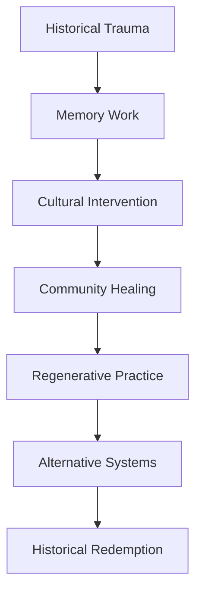

# 🏛️ Berlin Projects

> *"To articulate the past historically does not mean to recognize it 'the way it really was.' It means to seize hold of a memory as it flashes up at a moment of danger."* — Walter Benjamin

## ⟡ Overview ⟡

The Berlin Projects represent a concrete application of Benjamin's philosophy in the city where he lived, worked, and ultimately fled from fascism. These initiatives explore how dialectical thinking and historical consciousness can inform contemporary cultural work, community organizing, and regenerative practice in the German context.

## ⟡ Theoretical Framework ⟡

### Historical Redemption in Practice

Berlin serves as a unique laboratory for testing Benjamin's concepts because of its layered history of trauma, transformation, and ongoing reconstruction. The city embodies the "Angel of History" - facing the accumulation of catastrophe while being blown toward an uncertain future.

### Benjamin's Berlin Connection

**Historical Significance:**
- Benjamin's childhood and intellectual formation
- Weimar Republic cultural experimentation
- Nazi persecution and Benjamin's exile
- Contemporary memorial culture and remembrance work

**Philosophical Relevance:**
- Urban space as text to be read dialectically
- Walking as method of urban investigation
- Architecture as crystallized social relations
- Cultural memory as resistance practice

## ⟡ Current Initiatives ⟡

### [[berlin/projects/historical-walking-tours|Historical Walking Tours]]
*Dialectical exploration of Berlin's layered history*

**Methodology:**
- Benjamin's flaneur technique adapted for contemporary use
- Multi-temporal navigation through urban space
- Recognition of "monadic moments" in historical consciousness
- Community-based interpretation and meaning-making

### [[berlin/projects/cultural-memory-workshops|Cultural Memory Workshops]]
*Community-based exploration of trauma and healing*

**Focus Areas:**
- Holocaust remembrance and contemporary antisemitism
- GDR memory and post-unification integration
- Migration and contemporary diversity
- Climate crisis as historical continuity

### [[berlin/projects/cooperative-development|Cooperative Development]]
*Building solidarity economy in Berlin context*

**Components:**
- Housing cooperatives and alternative ownership models
- Worker cooperatives in creative industries
- Platform cooperatives for gig economy workers
- Community-supported agriculture (CSA) networks

### [[berlin/projects/regenerative-finance|Regenerative Finance Pilot]]
*Testing ReFi models in European context*

**Elements:**
- Local currency experiments
- Carbon credit systems for urban forests
- Community investment in renewable energy
- Participatory budgeting for ecological restoration

## ⟡ Research & Documentation ⟡

### [[berlin/research/benjamin-sites|Benjamin Sites Investigation]]
*Mapping Benjamin's Berlin through contemporary lens*

**Locations:**
- Childhood home and school locations
- University and intellectual gathering places
- Café and library study locations
- Exile departure points and memorial sites

### [[berlin/research/memory-landscapes|Memory Landscapes Study]]
*How historical trauma shapes urban space*

**Analysis:**
- Memorial architecture and public memory
- Neighborhood transformation and gentrification
- Immigration patterns and cultural integration
- Green space development and environmental justice

### [[berlin/research/alternative-economy|Alternative Economy Mapping]]
*Documenting existing solidarity economy initiatives*

**Categories:**
- Cooperative enterprises and social businesses
- Commons-based projects and shared resources
- Alternative currencies and exchange systems
- Mutual aid networks and community support

## ⟡ Cultural Interventions ⟡

### [[berlin/culture/dialectical-art|Dialectical Art Projects]]
*Creating "dialectical images" through contemporary art*

**Methods:**
- Photography that reveals historical contradictions
- Performance art interrupting routine temporality
- Community murals expressing collective memory
- Digital media mapping historical connections

### [[berlin/culture/storytelling|Community Storytelling]]
*Oral history and narrative healing practices*

**Approaches:**
- Intergenerational dialogue about historical trauma
- Migration stories and cultural bridge-building
- Climate activism and environmental justice
- Youth leadership development and empowerment

### [[berlin/culture/ritual|Regenerative Rituals]]
*Ceremonial practices for community healing*

**Elements:**
- Seasonal celebrations connecting urban and natural cycles
- Memorial practices honoring historical victims
- Community decision-making as sacred practice
- Cultural exchanges across ethnic and religious boundaries

## ⟡ Community Partnerships ⟡

### [[berlin/partnerships/universities|Academic Collaborations]]
*Research partnerships with Berlin institutions*

**Universities:**
- Humboldt University - Philosophy and History departments
- Free University - Cultural Studies and Anthropology
- Technical University - Urban Planning and Architecture
- European University Viadrina - Cultural Studies

### [[berlin/partnerships/organizations|Community Organizations]]
*Working relationships with local groups*

**Types:**
- Migrant community organizations
- Environmental justice groups
- Cooperative development organizations
- Memorial and remembrance institutions

### [[berlin/partnerships/government|Municipal Engagement]]
*Interface with Berlin government initiatives*

**Areas:**
- Participatory budgeting processes
- Climate action planning
- Social housing development
- Cultural programming support

## ⟡ Learning Resources ⟡

### [[berlin/resources/benjamin-texts|Benjamin Texts on Berlin]]
*Primary sources for understanding Benjamin's relationship to the city*

### [[berlin/resources/historical-context|Historical Context Materials]]
*Background reading for understanding Berlin's complex history*

### [[berlin/resources/contemporary-analysis|Contemporary Analysis]]
*Current scholarship on Berlin's transformation and development*

### [[berlin/resources/practical-guides|Practical Guides]]
*Resources for visitors and researchers working in Berlin*

## ⟡ Events & Programming ⟡

### [[berlin/events/annual-conference|Annual Conference]]
*"Becoming Constellations in Practice" - yearly gathering*

### [[berlin/events/monthly-salons|Monthly Salons]]
*Regular community gatherings for dialogue and planning*

### [[berlin/events/walking-seminars|Walking Seminars]]
*Mobile education through urban exploration*

### [[berlin/events/workshops|Skills Workshops]]
*Practical training in cooperative development and organizing*

## ⟡ Future Developments ⟡

### Research Expansion
- Comparative studies with other German cities
- International connections to similar projects
- Integration with European regenerative finance networks

### Community Building
- Residential cooperative development
- Community center establishment
- Youth leadership program expansion

### Cultural Programming
- Artist residency program
- International exchange initiatives
- Memorial culture innovation

---

*"The past carries with it a temporal index by which it is referred to redemption."* — Walter Benjamin