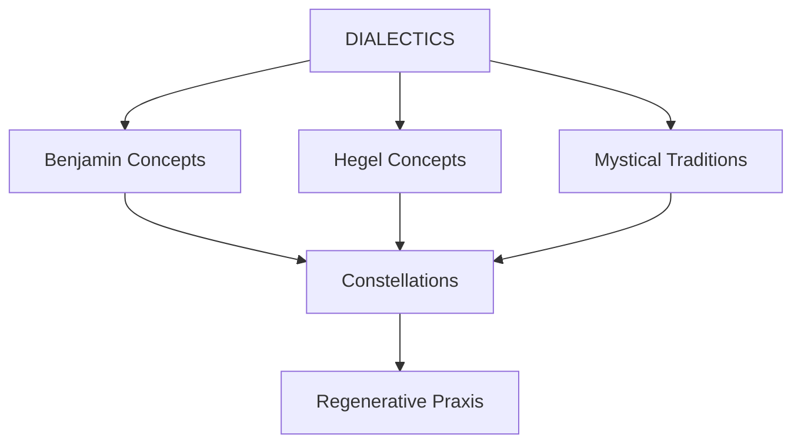

# ✧༺ Becoming Constellations ༻✧

> *"The true picture of the past flits by. The past can be seized only as an image which flashes up at the instant when it can be recognized and is never seen again."* — Walter Benjamin

## ⟡ Welcome to the Constellation ⟡

**Becoming Constellations** is a transdisciplinary knowledge garden exploring the intersections of time, dialectics, regenerative practice, and spiritual traditions. Drawing primarily on Walter Benjamin's philosophy and Hegelian dialectics, this project seeks to construct "constellations" of meaning across disparate domains of knowledge and practice.

The central thesis is that authentic transformation ("becoming") requires the dialectical negation of what currently "is" (being), creating momentary alignments (constellations) where past, present, and future illuminate each other in what Benjamin terms "monadic" moments.

## ⟡ Navigate the Garden ⟡

### 🌙 [[mondeszetteln/index|Mondeszetteln (Moon Notes)]]
*Lunar-based calendrical system integrating Islamic months, Hindu paksha divisions, and Benjamin's messianic time*

### 🎭 [[philosophy/index|Philosophical Framework]]
*Core concepts from Walter Benjamin, Hegelian dialectics, and mystical traditions*

### 🌱 [[regenerative/index|Regenerative Constellations]]
*Practical applications for community organization and regenerative economics*

### 🏛️ [[berlin/index|Berlin Projects]]
*Documentation of Berlin-based initiatives connecting theory to practice*

### 💭 [[concepts/index|Concepts & Ideas]]
*Philosophical explorations and theoretical developments*

### 📚 [[notes/index|Notes & Research]]
*In-depth studies and theoretical contributions*

### 📝 [[journaling/index|Reflections & Journaling]]
*Personal observations, meditations, and temporal consciousness*

### 👥 [[people/index|Thinkers & Influences]]
*Key figures and their contributions to the constellation*

### 📖 [[references/index|References & Sources]]
*External materials, readings, and inspirations*

## ⟡ Philosophical Framework ⟡

### Core Concepts
- **[[concepts/monad|Monad]]**: Crystallized fragments of time where past and present align
- **[[concepts/dialectical-image|Dialectical Image]]**: Visual manifestations of historical consciousness
- **[[concepts/messianic-time|Messianic Time]]**: Alternative to "homogeneous, empty time"
- **[[concepts/jetztzeit|Jetztzeit (Now-Time)]]**: Revolutionary potential of the present moment
- **[[concepts/aufhebung|Aufhebung (Sublation)]]**: Simultaneous preservation, negation, and transcendence

## ⟡ Recent Additions ⟡

*This section will be automatically populated with recently modified content*

## ⟡ Explore by Theme ⟡

Use the tag explorer and graph view to discover connections between ideas:

**Major Themes:**
- #dialectics - Dialectical thinking and contradictions
- #temporality - Time consciousness and lunar cycles  
- #regenerative - Regenerative economics and practices
- #benjamin - Walter Benjamin's concepts and applications
- #hegel - Hegelian philosophy and its applications
- #mystical - Spiritual traditions and cross-cultural synthesis
- #praxis - Theory-practice integration
- #constellation - Meaningful alignments and connections

---

*"The only historian capable of fanning the spark of hope in the past is the one who is firmly convinced that even the dead will not be safe from the enemy if he is victorious. And this enemy has never ceased to be victorious."* — Walter Benjamin