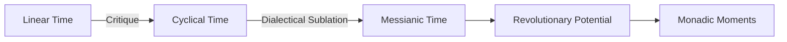

# 🌙 Mondeszetteln (Moon Notes)

> *"In every era the attempt must be made anew to wrest tradition away from a conformism that is about to overpower it."* — Walter Benjamin

## ⟡ Overview ⟡

**Mondeszetteln** is a lunar-based calendrical system that integrates:
- Islamic lunar months beginning at sunset
- Hindu paksha divisions (bright and dark fortnights)
- Walter Benjamin's concept of messianic time
- Practical daily reflection templates for consciousness work

This system provides an alternative to the "homogeneous, empty time" of capitalist modernity, offering instead a cyclical temporality that recognizes the revolutionary potential inherent in each moment.

## ⟡ Theoretical Foundation ⟡

### Messianic Time vs. Homogeneous Time

The Mondeszetteln system represents a dialectical synthesis that:
- Preserves cyclical awareness through lunar phases
- Negates linear progression through sacred interruption
- Transcends both through recognition of "monadic moments"

### Cultural Integration

**Islamic Elements:**
- Lunar months following the Hijri calendar
- Day beginning at sunset (Maghrib)
- Recognition of sacred temporal rhythms

**Hindu Elements:**  
- Paksha divisions (Shukla/Krishna)
- Tithi awareness for spiritual practice
- Integration of cosmic cycles with personal development

**Benjaminian Elements:**
- Jetztzeit (Now-Time) recognition
- Historical consciousness in daily practice
- Messianic interruption of routine temporality

## ⟡ Calendar Structure ⟡

### Monthly Organization
Each month contains:
- **New Moon (Amavasya)**: Beginning contemplation and intention setting
- **Waxing Phase (Shukla Paksha)**: Growth, manifestation, and creative work
- **Full Moon (Purnima)**: Culmination, completion, and synthesis
- **Waning Phase (Krishna Paksha)**: Release, reflection, and preparation

### Daily Practice Framework
Each Mondeszettel includes:
- **Temporal Coordinates**: Islamic date, Hindu tithi, astronomical data
- **Dialectical Reflection**: Current contradictions and their potential resolution
- **Constellation Mapping**: Connections between disparate elements of experience
- **Regenerative Praxis**: Concrete actions toward systemic transformation

## ⟡ Templates & Models ⟡

### [[mondeszetteln/templates/daily-template|Daily Mondeszettel Template]]
*Standard format for daily lunar consciousness practice*

### [[mondeszetteln/templates/monthly-template|Monthly Overview Template]]  
*Framework for lunar month planning and reflection*

### [[mondeszetteln/templates/seasonal-template|Seasonal Constellation Template]]
*Quarterly synthesis and pattern recognition*

## ⟡ Current Cycle ⟡

### Q1 2025 - Rabi' al-Awwal through Jamada al-Ula

**Key Themes for This Quarter:**
- Integration of theory and practice
- Community constellation building
- Regenerative economics experimentation
- Cultural bridge-building

**Major Monadic Moments:**
- [[mondeszetteln/2025/q1/250101-new-year-synthesis|January 1, 2025]] - New Year Synthesis
- [[mondeszetteln/2025/q1/250212-berlin-constellation|February 12, 2025]] - Berlin Project Culmination  
- [[mondeszetteln/2025/q1/250321-spring-equinox|March 21, 2025]] - Spring Equinox Dialectical Moment

## ⟡ Archives ⟡

### [[mondeszetteln/archives/2024|2024 Archive]]
*Complete collection of 2024 Mondeszetteln*

### [[mondeszetteln/archives/patterns|Pattern Recognition]]
*Recurring themes and cyclical insights*

### [[mondeszetteln/archives/methodology|Methodological Evolution]]
*Development of the Mondeszetteln practice*

## ⟡ Related Concepts ⟡

- [[concepts/messianic-time|Messianic Time]] - Temporal foundation
- [[concepts/monad|Monad]] - Crystallized moments of historical consciousness
- [[concepts/jetztzeit|Jetztzeit]] - Revolutionary potential of the present
- [[concepts/aufhebung|Aufhebung]] - Dialectical preservation/negation/transcendence
- [[philosophy/benjamin/temporal-consciousness|Benjamin's Temporal Consciousness]]

---

*"The concept of the historical progress of mankind cannot be sundered from the concept of its progression through a homogeneous, empty time."* — Walter Benjamin