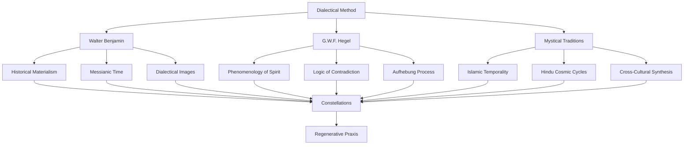

# 🎭 Philosophical Framework

> *"Every image of the past that is not recognized by the present as one of its own concerns threatens to disappear irretrievably."* — Walter Benjamin

## ⟡ Core Philosophical Architecture ⟡

The Becoming Constellations framework integrates three primary philosophical traditions into a coherent dialectical methodology:

## ⟡ Walter Benjamin's Contributions ⟡

### [[philosophy/benjamin/index|Benjamin's Philosophical Framework]]

**Core Concepts:**
- **[[concepts/monad|Monad]]** - Crystallized fragments where past and present align
- **[[concepts/dialectical-image|Dialectical Image]]** - Visual manifestations of historical consciousness  
- **[[concepts/messianic-time|Messianic Time]]** - Alternative to homogeneous, empty time
- **[[concepts/jetztzeit|Jetztzeit (Now-Time)]]** - Revolutionary potential of the present moment
- **[[concepts/angel-of-history|Angel of History]]** - Witnessing accumulation of catastrophe

**Applications:**
- [[philosophy/benjamin/historical-redemption|Historical Redemption]]
- [[philosophy/benjamin/temporal-consciousness|Temporal Consciousness]]
- [[philosophy/benjamin/revolutionary-practice|Revolutionary Practice]]

## ⟡ Hegelian Dialectical Method ⟡

### [[philosophy/hegel/index|Hegelian Framework]]

**Fundamental Structure:**
- **[[concepts/dialectical-movement|Dialectical Movement]]** - Thesis-Antithesis-Synthesis progression
- **[[concepts/aufhebung|Aufhebung (Sublation)]]** - Preservation, negation, and transcendence
- **[[concepts/geist|Geist (Spirit)]]** - Unfolding of consciousness through history
- **[[concepts/being-becoming|Being and Becoming]]** - Eternal conflict and resolution

**Contemporary Applications:**
- [[philosophy/hegel/modern-dialectics|Modern Dialectical Applications]]
- [[philosophy/hegel/consciousness-development|Consciousness Development]]
- [[philosophy/hegel/social-transformation|Social Transformation]]

## ⟡ Mystical & Cross-Cultural Traditions ⟡

### [[philosophy/mystical/index|Mystical Frameworks]]

**Islamic Elements:**
- **[[philosophy/mystical/islamic-temporality|Islamic Temporality]]** - Lunar calendar and sacred time
- **[[philosophy/mystical/sufi-dialectics|Sufi Dialectical Thought]]** - Batin/Zahir dynamics
- **[[philosophy/mystical/quranic-worldview|Qur'anic Worldview]]** - Comprehensive reality framework

**Hindu Elements:**
- **[[philosophy/mystical/paksha-system|Paksha System]]** - Bright/dark fortnight consciousness
- **[[philosophy/mystical/cosmic-cycles|Cosmic Cycles]]** - Temporal consciousness and rhythm
- **[[philosophy/mystical/dharmic-praxis|Dharmic Praxis]]** - Righteous action in cosmic context

**Synthesis:**
- [[philosophy/mystical/cross-cultural-patterns|Cross-Cultural Pattern Recognition]]
- [[philosophy/mystical/universal-principles|Universal Principles]]
- [[philosophy/mystical/wisdom-traditions|Wisdom Tradition Integration]]

## ⟡ Methodological Framework ⟡

### Dialectical Constellation Method

**Stage 1: Recognition**
- Identify contradictions in current reality
- Map opposing forces and their dynamic relationships
- Locate points of potential synthesis

**Stage 2: Constellation**
- Draw connections between disparate elements
- Create meaningful alignments across different domains
- Recognize "monadic moments" of heightened potential

**Stage 3: Synthesis**
- Develop practical applications of theoretical insights
- Create new organizational forms and practices
- Build regenerative systems that embody philosophical principles

### [[philosophy/methodology/index|Detailed Methodology]]

## ⟡ Contemporary Applications ⟡

### [[regenerative/index|Regenerative Economics]]
*Applying dialectical principles to economic transformation*

### [[berlin/index|Cultural Memory Work]]
*Benjamin's concepts in contemporary German context*

### [[concepts/dual-power|Dual Power Construction]]
*Building alternative systems while critiquing existing ones*

### [[concepts/commons|Commons Development]]
*Dialectical approach to resource sharing*

## ⟡ Key Philosophical Texts ⟡

### Primary Sources
- [[references/benjamin-theses|Walter Benjamin: "Theses on the Philosophy of History"]]
- [[references/hegel-phenomenology|Hegel: "Phenomenology of Spirit" (selections)]]
- [[references/hegel-logic|Hegel: "Science of Logic" (key passages)]]

### Secondary Sources
- [[references/buck-morss-dialectics|Susan Buck-Morss: "Dialectics of Seeing"]]
- [[references/benjamin-scholarship|Contemporary Benjamin Scholarship]]
- [[references/hegel-interpretation|Modern Hegel Interpretation]]

### Cross-Cultural Sources
- [[references/islamic-philosophy|Islamic Philosophical Texts]]
- [[references/hindu-philosophy|Hindu Philosophical Texts]]
- [[references/comparative-mysticism|Comparative Mystical Literature]]

## ⟡ Ongoing Developments ⟡

### Theoretical Expansion
- Integration with contemporary political theory
- Connections to systems thinking and complexity science
- Dialogue with decolonial and feminist philosophical traditions

### Practical Implementation
- Development of concrete organizational models
- Creation of ritual and ceremonial frameworks
- Building of community networks based on philosophical principles

---

*"The tradition of the oppressed teaches us that the 'state of emergency' in which we live is not the exception but the rule."* — Walter Benjamin