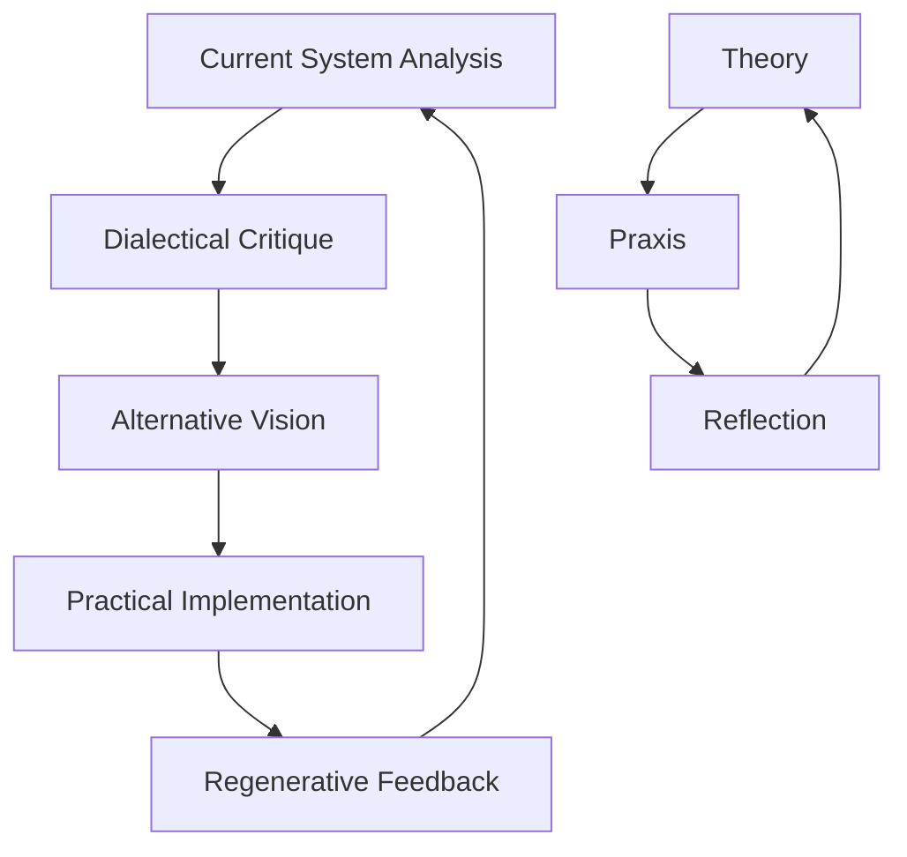

# 🌱 Regenerative Constellations

> *"The philosophers have only interpreted the world in various ways; the point is to change it."* — Marx (as filtered through dialectical practice)

## ⟡ Overview ⟡

**Regenerative Constellations** represents the practical application of dialectical philosophy to contemporary challenges of economic and social transformation. This section explores how the theoretical frameworks of Benjamin, Hegel, and mystical traditions can be embodied in concrete organizational forms and regenerative economic practices.

## ⟡ Theoretical Foundation ⟡

### From Critique to Construction

**Core Principle:** Authentic transformation requires simultaneously critiquing existing systems while building alternative structures that embody the values and relationships we seek to create.

## ⟡ Key Frameworks ⟡

### [[regenerative/dual-power/index|Dual Power Development]]
*Building alternative institutions while engaging critically with existing systems*

**Components:**
- [[regenerative/dual-power/cooperatives|Cooperative Enterprises]]
- [[regenerative/dual-power/mutual-aid|Mutual Aid Networks]]
- [[regenerative/dual-power/alternative-currencies|Alternative Economic Systems]]
- [[regenerative/dual-power/governance-models|Participatory Governance]]

### [[regenerative/commons/index|Commons-Based Organization]]
*Creating shared resource management systems*

**Areas:**
- [[regenerative/commons/knowledge|Knowledge Commons]]
- [[regenerative/commons/land|Land Commons]]
- [[regenerative/commons/digital|Digital Commons]]
- [[regenerative/commons/cultural|Cultural Commons]]

### [[regenerative/refi/index|Regenerative Finance (ReFi)]]
*Aligning financial systems with ecological and social healing*

**Applications:**
- [[regenerative/refi/carbon-markets|Carbon Credit Systems]]
- [[regenerative/refi/biodiversity|Biodiversity Tokens]]
- [[regenerative/refi/community-currencies|Community Currency Design]]
- [[regenerative/refi/impact-measurement|Impact Measurement Frameworks]]

## ⟡ Organizational Models ⟡

### [[regenerative/organizations/dao|Decentralized Autonomous Organizations (DAOs)]]
*Blockchain-enabled governance experiments*

**Case Studies:**
- [[regenerative/organizations/dao/refi-dao|ReFi DAO]] - Network governance for regenerative finance
- [[regenerative/organizations/dao/local-nodes|Local Node Networks]] - Bioregional coordination
- [[regenerative/organizations/dao/funding-pools|Collaborative Funding Pools]]

### [[regenerative/organizations/cooperatives|Cooperative Structures]]
*Democratic ownership and governance models*

**Types:**
- [[regenerative/organizations/cooperatives/worker|Worker Cooperatives]]
- [[regenerative/organizations/cooperatives/platform|Platform Cooperatives]]
- [[regenerative/organizations/cooperatives/multi-stakeholder|Multi-Stakeholder Cooperatives]]

### [[regenerative/organizations/hybrid|Hybrid Models]]
*Combining traditional and innovative organizational forms*

## ⟡ Economic Frameworks ⟡

### [[regenerative/economics/doughnut|Doughnut Economics]]
*Operating within planetary boundaries and social foundations*

### [[regenerative/economics/circular|Circular Economy]]
*Closing material loops and eliminating waste*

### [[regenerative/economics/gift|Gift Economy Elements]]
*Incorporating reciprocity and abundance thinking*

### [[regenerative/economics/bioregional|Bioregional Economics]]
*Aligning economic activity with ecological boundaries*

## ⟡ Technology & Tools ⟡

### [[regenerative/technology/blockchain|Blockchain for Regeneration]]
*Decentralized systems for coordination and value exchange*

### [[regenerative/technology/measurement|Impact Measurement Technology]]
*Tools for tracking regenerative outcomes*

### [[regenerative/technology/communication|Communication Platforms]]
*Facilitating collaborative decision-making*

### [[regenerative/technology/local-currencies|Local Currency Systems]]
*Technology supporting regional economic resilience*

## ⟡ Community Practices ⟡

### [[regenerative/practices/decision-making|Consensus and Sociocracy]]
*Participatory decision-making processes*

### [[regenerative/practices/conflict-resolution|Restorative Justice]]
*Healing-centered approaches to conflict*

### [[regenerative/practices/ritual|Regenerative Rituals]]
*Ceremonial practices supporting transformation*

### [[regenerative/practices/education|Popular Education]]
*Community-based learning and skill sharing*

## ⟡ Case Studies ⟡

### [[regenerative/case-studies/barcelona|Barcelona: Municipal Commons]]
*Municipal policies supporting cooperative development*

### [[regenerative/case-studies/jackson|Jackson, Mississippi: Cooperation Jackson]]
*Comprehensive community development through cooperatives*

### [[regenerative/case-studies/emilia-romagna|Emilia-Romagna: Cooperative Networks]]
*Regional cooperative ecosystem development*

### [[regenerative/case-studies/kerala|Kerala: Participatory Planning]]
*State-level democratic planning experiments*

## ⟡ Current Projects ⟡

### [[regenerative/projects/local-refi-toolkit|Local ReFi Toolkit]]
*Resources for bioregional regenerative finance implementation*

### [[regenerative/projects/refi-barcelona|ReFi Barcelona]]
*Municipal cooperative development initiative*

### [[regenerative/projects/berlin-commons|Berlin Commons Project]]
*Urban commons development in German context*

### [[regenerative/projects/cooperation-network|Cooperation Network Development]]
*Cross-bioregional coordination systems*

## ⟡ Resources & Tools ⟡

### [[regenerative/resources/funding|Funding Sources]]
*Financial resources for regenerative projects*

### [[regenerative/resources/networks|Networks & Communities]]
*Connecting with like-minded organizations*

### [[regenerative/resources/education|Educational Materials]]
*Learning resources for regenerative practice*

### [[regenerative/resources/legal|Legal Frameworks]]
*Understanding cooperative and commons law*

## ⟡ Measurement & Evaluation ⟡

### [[regenerative/measurement/indicators|Regenerative Indicators]]
*Metrics for assessing regenerative impact*

### [[regenerative/measurement/feedback-systems|Feedback Systems]]
*Creating learning loops for continuous improvement*

### [[regenerative/measurement/storytelling|Impact Storytelling]]
*Narrative approaches to evaluation*

---

*"Another world is not only possible, she is on her way. On a quiet day, I can hear her breathing."* — Arundhati Roy